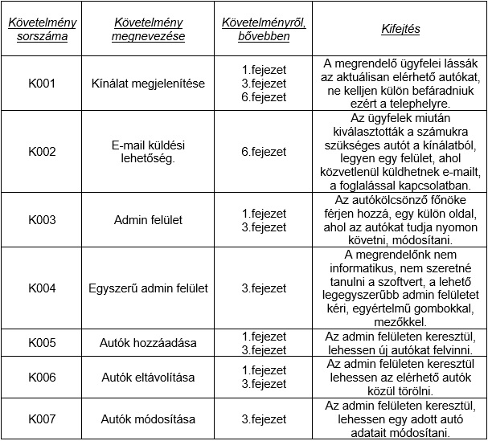

# Funkció specifikáció

## 1. Áttekintés

A rendszer alapvető célja egy autókölcsönző webes felületű alkalmazás mellyel egy autókölcsönző üzleti folymatai válnak egyszerűbbé. Az alkalmazás segítségével a megrendelő versenyben marad a rivális autókölcsönzőkkel szemben. Az alkalmazás installálása után az autókölcsönző hatékonysága növekedni fog. A rendszernek nem célja, teljes egészében lecserélni a személyes kommunikációt. Az alkalmazás elsősorba az ott dolgozók munkáját fogja könnyebbé tenni.

## 2. Jelenlegi helyzet

Jelenleg az autókölcsönzőben azt, hogy ki, milyen autót, mikor, mennyi időre bérelt ki, csak papír alapon tekinthető meg. A papír alapú módszer, működik, de eléggé lassú, emberi hibából adódóan a félreértések esélye jelentős. A megírt lapok elveszhetnek, szennyeződhetnek, az emberi írás mások számára olvashatatlan lehet.Az emberek jelenleg csak úgy tudnak tájékozódni az elérhető autókról, azok típusáról, tulajdonságairók, ha személyesen bemennek a céghez. Ezt a plusz utat szeretné a megrendelő kikerülni, azzal, hogy online elérhetővé teszi azon autókat melyeket a cég kínál. A megrendelő szereti a modern dolgokat, többek között is ezért is gondolta úgy, hogy itt az ideje elkészíteni az alkalmazást.

## 3 Vágyálomrendszer

A megrendelő egy olyan alkalmazást szeretne ami, segítené az ő ügyfeleit abban, hogy elérjék az általuk kínált autókat anélkül, hogy az ügyfél befáradna a kölcsönzőbe, ezzel biztosítani a rugalmasságot, gyorsaságot. A szoftver rendelője a későbbiekben valószínűleg továb szeretné fejlesztettni a meglévő applikációt, jelenleg kísérleteznek vele, milyen mértékű pozitív visszajelzéseket kapnak, később ennek megfelelően a szoftvert valószínűleg bővíteni kell egyéb funkciókkal.Az elérhető autók listázása mellett e megrendelő szeretné, ha gyorsan, egyszerűen lehetne autókat hozzáadni a kínálathoz, abban az esetben, ha bővíteni szeretné a flottát, valamint a meglévő autókat tudja módosítani, szükség esetén eltávolítani a megjelenítendő autók közül, erre egy külön oldalt szeretne, amihez csak ő fér hozzá. Fontos számára, hogy egyértelműek legyenek a gombok, a mezők, mit, hova kell beírni, vagy éppen hova, melyik gombra kell kattintani, az egyszerű kezelhetőséget támogatja. Nem szeretne több munkanapot eltölteni azzal, hogy megtanulja használni a szoftvert. A szoftvernek készen kell állnia arra, hogy bővíthető legyen, egyéb funkciókkal, a későbbiekben elképzelhető, hogy a megrendelő szeretne regisztrálási lehetőséget, a rendszeresen tőle bérlőknek kedvezményeket nyújtani, ezeket nyilvántartani.

## 4. Jelenlegi üzleti folyamatok

A jelenlegi rendszerben az megrendelő ügyfeleinek, elkell menniük az autókölcsönző telephelyére, vagy el kell látogatniuk az autókölcsönző weboldalára, ahol láthatja milyen autó kínálattal rendelkeznek, ezek közül tud választani egyet. Ezután egy ott dolgozóval pontosan fixálják az adatokat, hogy mikortól kell, mennyi időre, a bérlési folyamat első szakasza ezzel végbe is zajlott. A második szakasza a bérlésnek akkor kezdődik amikor érte megy az előre egyeztetett autóért, ilyenkor keresnie kell egy ott dolgozót, aki segít neki átadja a szükséges dolgokat, ezután használhatja az autót, majd végül a bérlés lejáratának napján visszahozza az autót.

## 5. Igényelt üzleti folyamatok

A megrendelő ügyfele otthon, vagy akár a buszon ülve is képes információt szeretni arról, hogy milyen autók lelhetők fel az autó kölcsönzőben, ezeket telefonon vagy akár e-mail-en is letudja foglalni egy előre meghatározott időpontra. Az előre fixált időponton az ügyfél elfárad az autókölcsönzőbe, ahol az ott dolgozók már várni fogják. Elkísérik az általa kiválasztott autóhoz, majd átadják a szükséges dolgokat. Ezután az ügyfél használhatja az autót. A bérlési idő lejáratának napján visszahozza.

## 6. Követelménylista

## 7. Használati esetek

Az alkalmazás használati esetei közül a leggyakoribb amikor a felhasználók a weboldalon keresztül a megrendelhető autókat megtekintheti valamint az e-mailon keresztül történő autók bérlése. Valamint amikor az autókölcsönző főnöke az alkalmazásba belépve az autók módosítását, törlését és új autó hozzáadását végezheti.

## 8. Képernyőterv

## 9. Forgatókönyv

Az ügyfélnek szüksége van egy autóra. Jelenleg nincs az utókölcsönző közelében hanem otthonában tartózkodik ezért felkeresi az autókölcsönző oldalt. A jelenleg bérelhető autók közül válogathat. Majd miután kiválasztotta a számára legmegfelőbbet akkor küld egy emailt a kölcsönzőnek, hogy melyik autót és milyen időtartamra szeretné igénybe venni.

A kölcsönző vezetője ha bent van az irodájában akkor meg tudja tekinteni az összes általuk kínált autót. Ezeket módosítani és újabb autókkal is tudja bővíteni a kínálatot. Ezen felül ugyanezeket a műveleteket meg tudja csinálni ha az irodán kívül van.

## 10. Funkciók

## 11. Fogalomszótár

React: Egy JavaScript könyvtár felhasználói felületek tervezéséhez, a Facebook készítette. Létre lehet hozni egy teljesen működőképes, dinamikus alkalmazást vele. Használatának előnyei közé tartozik, hogy rendkívül hatékony, és erőssége a SEO (search engine optimalization).A Reactet komponens alapú nézetek készítésére tervezték.

NodeJS: A Node.js (vagy másnéven Node) egy rendszer, melyben JavaScriptben írhatunk szerver oldali alkalmazásokat. Maga a rendszer C/C++-ban íródott, és egy esemény alapú I/O rendszert takar a Google V8 JavaScript motorja felett.

MongoDB: Egy nyílt forráskódú dokumentumorientált adatbázis szoftver, amelyet a 10gen fejleszt. A NoSQL adatbázisszerverek közé tartozik. A dokumentumokat JSON-szerű formátumban tárolja (BSON). A legnépszerűbb NoSQL adatbázis szoftver.

JSON: A JSON (JavaScript Object Notation) egy kis méretű, szöveg alapú szabvány, ember által olvasható adatcserére. A JavaScript szkript nyelvből alakult ki egyszerű adatstruktúrák és asszociatív tömbök reprezentálására (a JSON-ban objektum a nevük). A JavaScripttel való kapcsolata ellenére nyelvfüggetlen, több nyelvhez is van értelmezője. A JSON-t legtöbbször egy szerver és egy kliens számítógép közti adatátvitelre használják, az XML egyik alternatívájaként. Általánosságban strukturált adatok tárolására, továbbítására szolgál.

JavaScript: A JavaScript programozási nyelv egy objektumorientált, prototípus alapú szkriptnyelv, amelyet weboldalakon elterjedten használnak. A JavaScript kód vagy a html fájlban vagy külön (jellemzően .js kiterjesztésű) szövegfájlban van. Ezek a fájlok tetszőleges szövegszerkesztő (nem dokumentumszerkesztő) programmal szerkeszthetőek.
